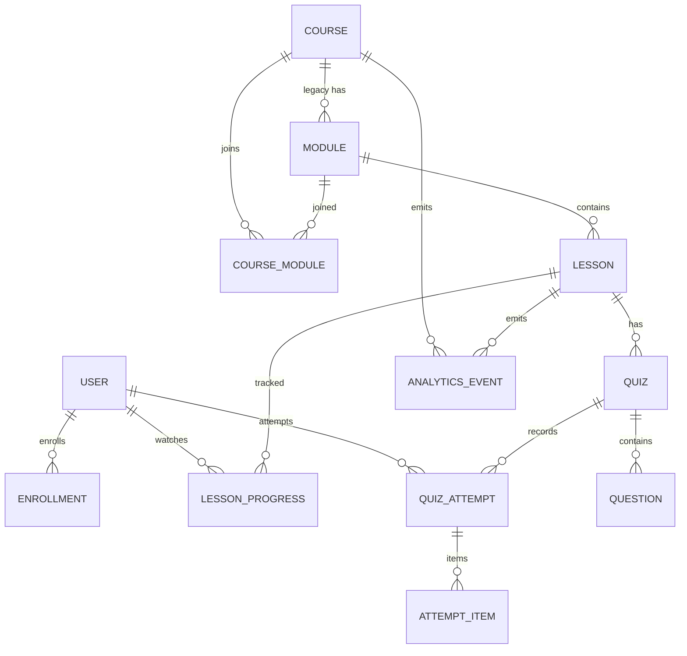
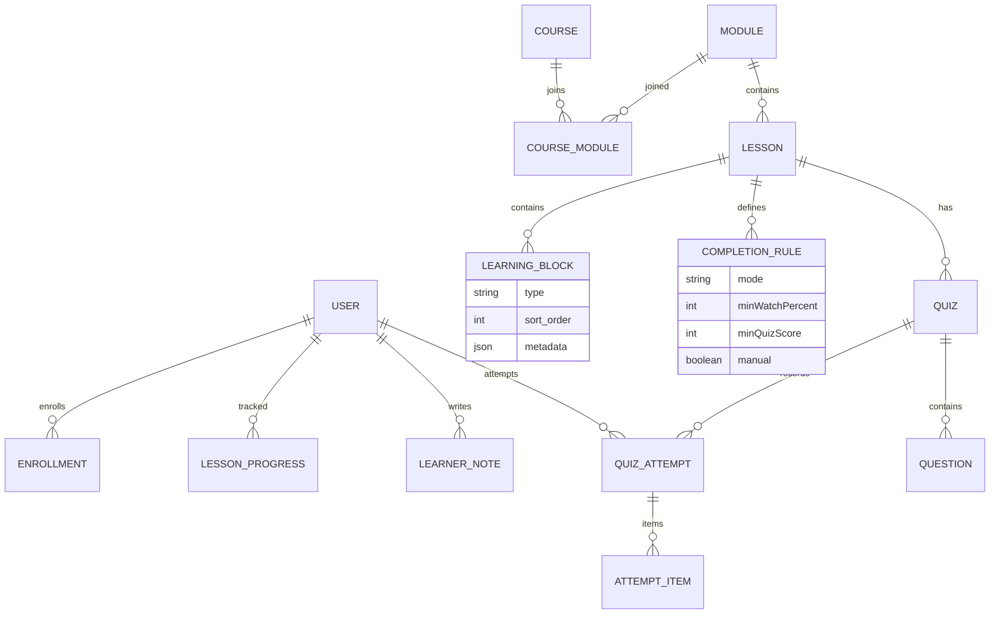
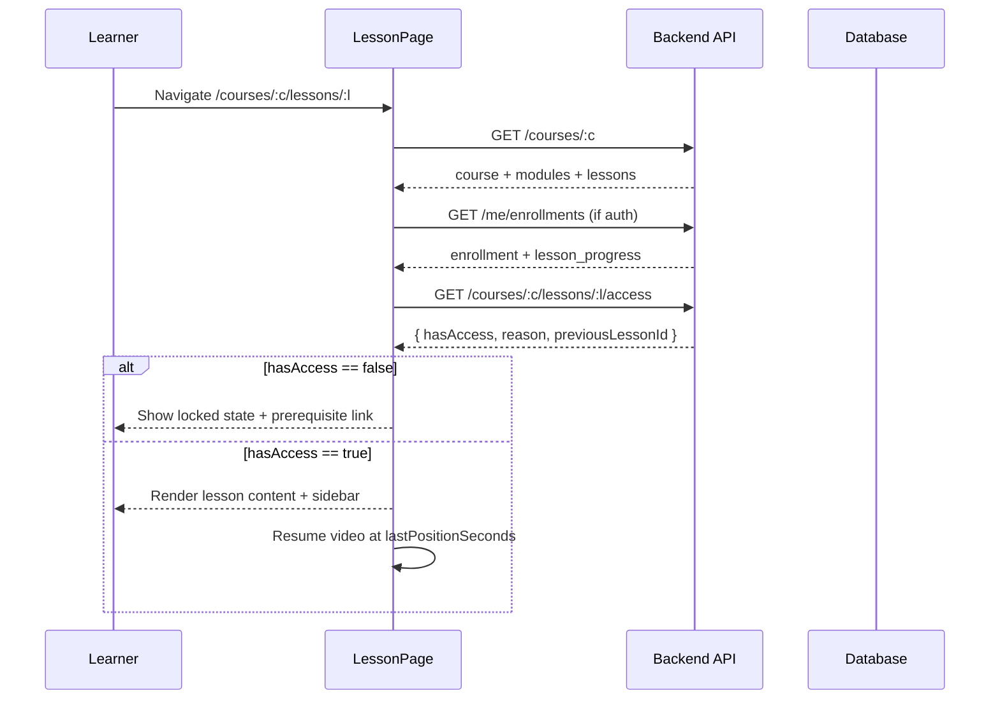
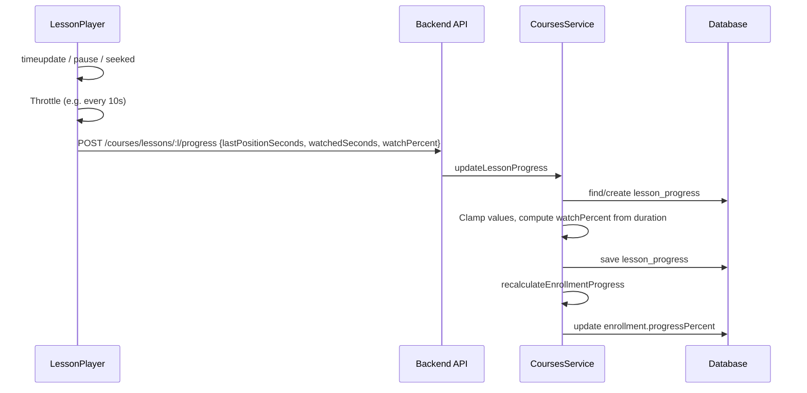
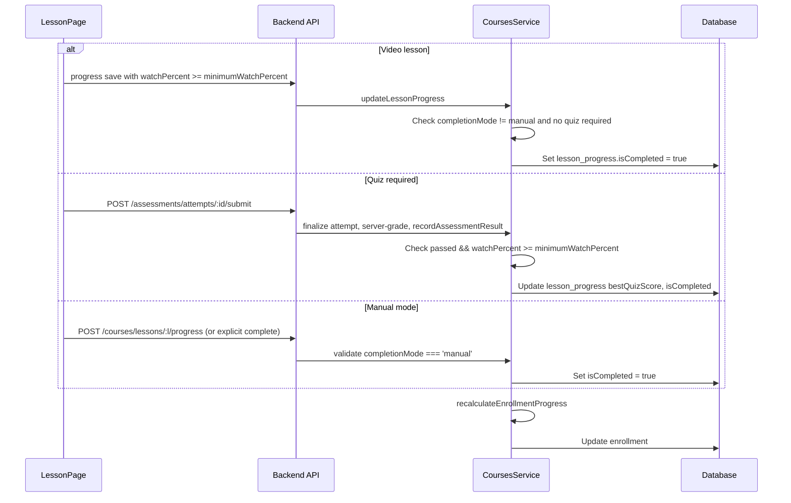
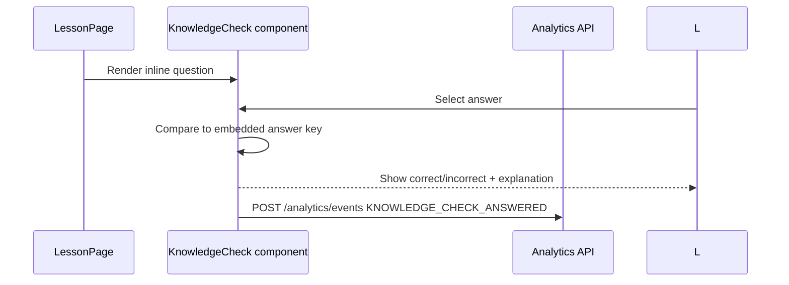
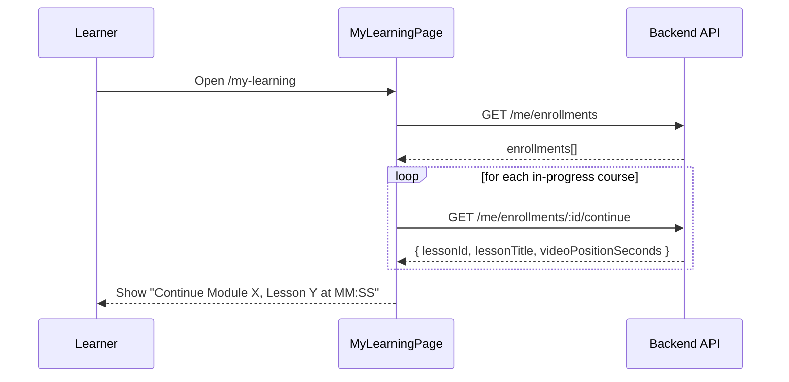

# Lesson Engine Architecture

This document describes the current learning architecture, the target architecture, the differences between them, safe migration requirements, and key data flows. It was produced during the audit phase before implementation.

---

## 1. Current Architecture

### 1.1 Domain hierarchy

```text
Course
├── Module          (legacy: modules.course_id points to one course)
│   └── Lesson      (lessons.module_id points to one module)
│       ├── Video URL
│       ├── Text/HTML content
│       ├── Transcript (plain text)
│       ├── Resource links
│       ├── Completion mode + minimum watch percent
│       └── Quiz    (one-to-one-ish; in assessments.quizzes.lesson_id)
│           ├── Question
│           └── QuizAttempt (with AttemptItem snapshots)
├── Enrollment      (user_id + course_id, progress percent, completed_at)
└── LessonProgress  (user_id + lesson_id, watch percent, quiz best score, is_completed)
```

There is also a `course_modules` join table for reusable modules, but the current `findOne` path loads modules via the legacy `modules.course_id` relation rather than the join table.

### 1.2 Mermaid diagram — current



### 1.3 Key current files

- `backend/src/courses/entities/course.entity.ts`
- `backend/src/courses/entities/module.entity.ts`
- `backend/src/courses/entities/lesson.entity.ts`
- `backend/src/courses/entities/lesson-progress.entity.ts`
- `backend/src/courses/entities/course-module.entity.ts`
- `backend/src/assessments/entities/quiz.entity.ts`
- `backend/src/assessments/entities/question.entity.ts`
- `backend/src/assessments/entities/quiz-attempt.entity.ts`
- `backend/src/assessments/entities/attempt-item.entity.ts`
- `backend/src/courses/courses.service.ts`
- `backend/src/assessments/assessments.service.ts`
- `frontend/src/pages/courses/[courseId]/lessons/[lessonId].tsx`
- `frontend/src/components/LessonPlayer.tsx`
- `frontend/src/components/ui/CourseKnowledgeSpine.tsx`
- `frontend/src/lib/api/courses.ts`
- `frontend/src/lib/api/assessments.ts`

### 1.4 Current strengths

- Server-authoritative lesson completion and course progress recalculation.
- Assessment engine supports attempt snapshots, deadlines, cooldowns, manual grading, and answer-key hiding.
- HLS video delivery with `hls.js` fallback and carbon-aware quality capping.
- Module reuse schema exists in the join table.
- Analytics event ingestion is already wired.

---

## 2. Target Architecture

The target keeps the existing `Course → Module → Lesson` container model and adds an optional, ordered collection of **Learning Blocks** inside each Lesson. It also introduces a small **Completion Rules** engine and a unified **Progress/Resume** record.

### 2.1 Domain hierarchy

```text
Course
├── Module
│   └── Lesson
│       ├── LearningBlock[] (ordered)
│       │   ├── VideoBlock
│       │   ├── TextBlock
│       │   ├── ImageBlock
│       │   ├── DocumentBlock / DownloadBlock
│       │   ├── KnowledgeCheck (formative)
│       │   ├── Reflection (self-reported)
│       │   └── QuizBlock (summative)
│       └── CompletionRule
│           ├── requiredBlocks[]
│           ├── minimumWatchPercent
│           ├── minimumQuizScore
│           └── manualConfirmation
├── Enrollment
├── LessonProgress
│   ├── lastPositionSeconds
│   ├── watchedSeconds
│   ├── activeSeconds
│   ├── watchPercent
│   ├── bestQuizScore
│   ├── isCompleted
│   └── completedAt
└── LearnerNote
    ├── lessonId
    ├── videoTimestampSeconds
    └── content
```

### 2.2 Mermaid diagram — target



### 2.3 Target principles

1. **Reuse > duplicate.** Keep the existing `lesson_progress` table as the single source of truth for watch/quiz progress. Extend it rather than creating another progress table.
2. **Server validation > client trust.** Completion decisions are made by `CoursesService` after reading the authoritative `lesson_progress` and `quiz_attempts` tables.
3. **Incremental migration > big-bang rewrite.** Existing lessons are backfilled into a single default block. New lessons can use multiple blocks without breaking old ones.
4. **Configuration > hard-coding.** Completion rules live on the lesson/rule record, not as global constants.

---

## 3. Differences Between Current and Target

| Area | Current | Target | Gap |
|------|---------|--------|-----|
| Lesson content | Single record with `videoUrl`, `content`, `transcript`, `resourceLinks` | Lesson is a container of ordered `LearningBlock`s | Cannot mix video, text, quiz, etc. in one lesson |
| Completion rules | `completionMode`, `minimumWatchPercent`, `minimumQuizScore` fields; manual mode unsupported in UI | Explicit `CompletionRule` with required blocks, watch %, quiz score, manual confirmation | Manual mode not exposed; multi-condition rules not possible |
| Video progress | Only saved as 100% on `ended` | Throttled saves of `lastPositionSeconds`, `watchedSeconds`, `watchPercent` | No resume, no partial progress |
| Transcript | Stored as plain text, not shown | Rendered as clickable, timestamped panel | Accessibility gap |
| Notes | None | `LearnerNote` anchored to lesson/video timestamp | Missing |
| Outline sidebar | Static current/pending based on URL | Dynamic completed/locked/current based on real progress | Misleading learner state |
| Analytics | Events table only; no funnel | Events + summary/funnel queries | No drop-off visibility |
| AI companion | Chat only | RAG-grounded chat with citations | Hallucination risk |

---

## 4. Migration Requirements

### 4.1 Database migrations (safe, additive)

1. **Extend `lesson_progress`**
   - Add `last_position_seconds` INT DEFAULT 0.
   - Add `watched_seconds` INT DEFAULT 0.
   - Add `active_seconds` INT DEFAULT 0.
   - Backfill `watched_seconds` from `watch_percent * video_duration` where available.
2. **Create `lesson_blocks`** (deferred until T3-03 is unblocked)
   - Columns: `id`, `lesson_id`, `type` (enum), `sort_order`, `metadata` JSON, `created_at`, `updated_at`.
   - Backfill every existing lesson with one block derived from `type`, `video_url`, `content`, `transcript`, `resource_links`.
3. **Create `learner_notes`** (deferred until T2-02)
   - Columns: `id`, `user_id`, `course_id`, `lesson_id`, `video_timestamp_seconds`, `content`, `created_at`, `updated_at`.
   - Indexes on `(user_id, lesson_id)` and `(user_id, course_id)`.
4. **Drop `progress` table** (deferred until T0-05 is unblocked)
   - Confirm no live rows.
   - Remove entity and all references.

### 4.2 API contract changes

- `POST /courses/lessons/:lessonId/progress` accepts additional optional fields (`lastPositionSeconds`, `watchedSeconds`, `watchPercent`). Response includes the same.
- `GET /me/enrollments/:id/continue` (new) returns the exact resume lesson and video position.
- `GET /courses/:courseId/lessons/:lessonId/access` already exists; it should be called by the frontend on page load.
- `GET /courses/:id` continues to return the same shape; block renderer can read `blocks` when present.

### 4.3 Frontend migration path

1. Add resume and throttled progress saving to `LessonPlayer`.
2. Use `checkLessonAccess` on lesson page load and render locked states.
3. Pass real progress/enrollment into `CourseKnowledgeSpine`.
4. Add transcript panel and resource list.
5. Later, replace the monolithic content render with a `<LearningBlockRenderer />` that supports legacy single-block lessons.

---

## 5. Data Flows

### 5.1 Open a lesson



### 5.2 Watch video / save progress



### 5.3 Complete a lesson



### 5.4 Submit a knowledge check (formative)



### 5.5 Resume learning from dashboard



---

## 6. Backward-Compatibility Risks

| Change | Risk | Mitigation |
|--------|------|------------|
| Adding `last_position_seconds` to `lesson_progress` | Low | Default 0; existing rows resume at 0. |
| Enforcing sequential access on lesson page | Medium | Keep the existing `checkLessonAccess` logic; only the frontend starts calling it. First lesson remains accessible without enrollment. |
| Rendering `resourceLinks` and transcripts | Low | Only adds UI for existing data. |
| Removing `courses/entities/enrollment.entity.ts` | Medium | Verify no code imports it before deleting; update `DatabaseModule`. |
| Dropping `progress` table | High | BLOCKED until production data audit confirms it is unused. |
| Adding `lesson_blocks` table | High | Backfill existing lessons as single blocks; keep legacy fields until all content is migrated. |
| Multi-condition completion rules | Medium | New `CompletionRule` table; legacy lessons use the existing fields as a fallback. |

---

## 7. Recommended Implementation Sequence

1. **Stabilize the foundation:** T0-01 to T0-04.
2. **Restore progress reliability:** T1-01 (video resume + throttled saves).
3. **Improve learner orientation:** T1-03, T1-04, T1-05.
4. **Complete the core loop:** T1-02, T1-08, T1-09.
5. **Observability:** T1-06, T1-07.
6. **Advanced features:** T2-01 to T2-06, then T3-01 to T3-04.

Do not start blocked items until the relevant product, infrastructure, or migration decision is made.
